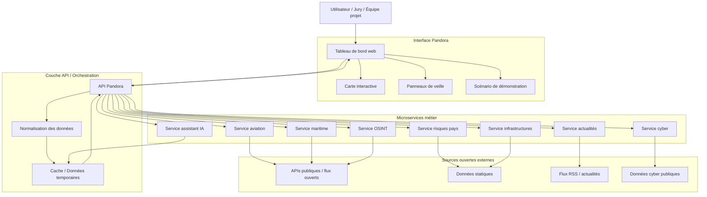
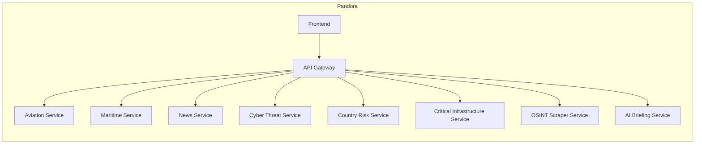
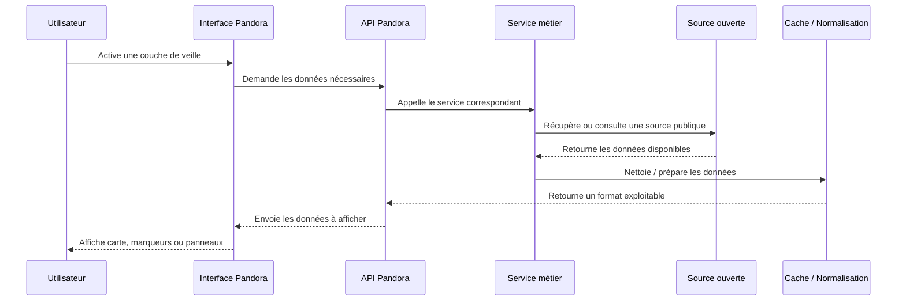
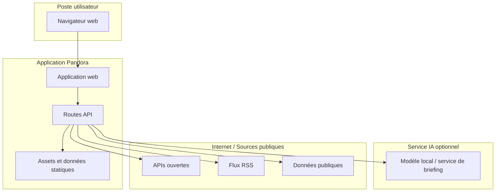
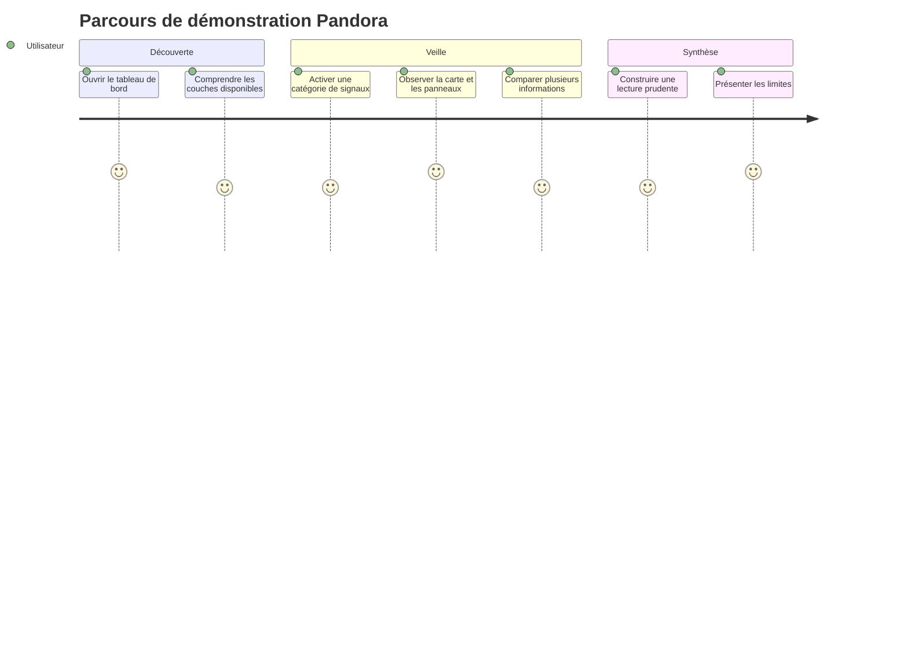

# Dossier architecture - Pandora 168H

## Objectif du document

Ce document décrit l'architecture de **Pandora**, le projet du module 168H. Il se concentre sur le fonctionnement général, les microservices, les flux de données et les responsabilités de chaque bloc.

Le volet GPE n'est pas traité ici.

## Vue d'ensemble

Pandora est une plateforme web de veille OSINT. Elle centralise plusieurs catégories de signaux publics dans une interface unique : carte interactive, panneaux de veille, flux d'actualité, alertes cyber, données géographiques, aviation, maritime, infrastructures et risques pays.

L'architecture est pensée comme un ensemble de services spécialisés. Chaque service récupère ou prépare une catégorie d'information, puis l'interface Pandora les affiche sous une forme exploitable.

## Schéma global Mermaid

## Découpage en microservices

## Rôle des services

| Service | Rôle | Exemple de valeur pour la démo |
| :--- | :--- | :--- |
| Interface Pandora | Afficher la carte, les couches et les panneaux | Donner une vision globale rapidement |
| API Pandora | Centraliser les demandes de l'interface | Éviter que le frontend appelle directement toutes les sources |
| Service aviation | Fournir des informations liées aux vols ou bases aériennes | Observer l'activité ou le contexte aérien |
| Service maritime | Fournir des ports, routes ou points maritimes sensibles | Visualiser des zones stratégiques |
| Service actualités | Agréger des flux d'information publics | Relier la carte à l'actualité |
| Service cyber | Présenter des signaux de menace ou vulnérabilités publiques | Ajouter une dimension cybersécurité |
| Service risques pays | Donner un contexte de risque par zone | Aider à prioriser l'analyse |
| Service infrastructures | Afficher des points d'intérêt critiques | Identifier les zones sensibles |
| Service OSINT | Rassembler des signaux ouverts complémentaires | Enrichir la veille |
| Service IA | Générer une synthèse ou un briefing d'aide | Faciliter l'explication orale |

## Flux de données

## Architecture de déploiement cible

## Parcours utilisateur

## Contraintes d'architecture

- Les sources ouvertes peuvent être incomplètes ou indisponibles.
- La plateforme doit rester démontrable même si une source externe ne répond pas.
- Les données doivent être présentées comme des signaux, pas comme une vérité absolue.
- Le prototype doit rester compréhensible pour la soutenance.
- Le système doit séparer clairement l'affichage, la récupération des données et la préparation des données.

## Choix structurants

- **Architecture orientée services** : chaque domaine de veille est isolé dans un service logique.
- **API centrale** : l'interface passe par une couche API plutôt que d'interroger directement toutes les sources.
- **Normalisation des données** : les informations sont préparées pour être affichées de manière cohérente.
- **Carte interactive** : la carte sert de point d'entrée visuel principal.
- **Preuves de secours** : captures et scénario prévu en cas d'indisponibilité externe.

## Limites assumées

- Pandora reste un prototype 168H.
- Les informations affichées doivent être vérifiées avant toute interprétation sérieuse.
- Certaines sources peuvent être simulées, statiques ou indisponibles selon le contexte de démonstration.
- L'outil ne remplace pas une analyse humaine.

## Résultat attendu pour la soutenance

À la fin du sprint, l'équipe doit pouvoir expliquer :

1. le problème traité par Pandora ;
2. le fonctionnement général de l'architecture ;
3. le rôle des principaux microservices ;
4. le flux d'une donnée depuis une source ouverte jusqu'à l'affichage ;
5. les limites du prototype ;
6. les preuves produites pendant les 168h.
